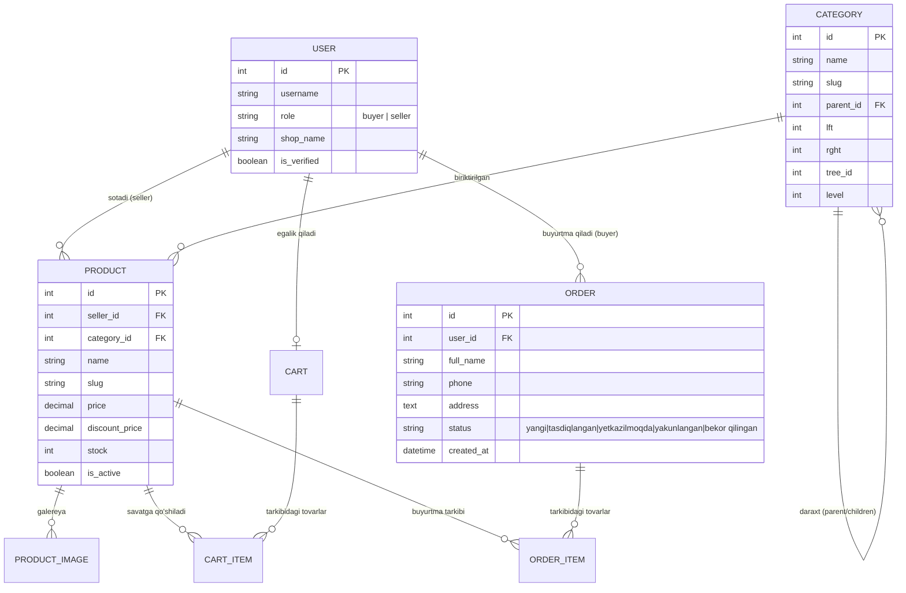

# 🛒 MarketPlace — Multi-Vendor E-Commerce Platform

<p align="center">
  
</p>

<p align="center">
  <a href="https://www.python.org/"></a>
  <a href="https://www.djangoproject.com/"></a>
  <a href="https://www.postgresql.org/"></a>
  <a href="https://django-mptt.github.io/django-mptt/"></a>
  <a href="https://django-jazzmin.readthedocs.io/"></a>
  <a href="#"></a>
  <a href="LICENSE"></a>
</p>

---

## 📖 Mundarija

1. [Loyiha Haqida](#-loyiha-haqida)
2. [Muhandislik Qarorlari & Arxitektura](#-muhandislik-qarorlari--arxitektura)
3. [Asosiy Funksional Imkoniyatlar](#-asosiy-funksional-imkoniyatlar)
4. [Ma'lumotlar Bazasi Modeli (ER sxema)](#-malumotlar-bazasi-modeli)
5. [Texnologiyalar Steki](#-texnologiyalar-steki)
6. [Tezkor O'rnatish va Ishga Tushirish](#-tezkor-ornatish-va-ishga-tushirish)
7. [Tayyor Demo Foydalanuvchilar](#-tayyor-demo-foydalanuvchilar)
8. [AJAX API Endpointlari](#-ajax-api-endpointlari)
9. [Avtomatlashtirilgan Testlar](#-avtomatlashtirilgan-testlar)
10. [Loyiha Kataloglar Tuzilishi](#-loyiha-kataloglar-tuzilishi)
11. [Xavfsizlik va Kesh Optimizatsiyasi](#-xavfsizlik-va-ishlash-samaradorligi)
12. [Muallif va Aloqa](#-muallif-va-aloqa)

---

## 📌 Loyiha Haqida

**MarketPlace** — bu real ishlab chiqarish (production-ready) talablariga mos ravishda loyihalashtirilgan, mustaqil sotuvchilar (multi-vendor) ekotizimi, xaridorlar portali va markazlashgan administrator boshqaruvini o'zida birlashtirgan to'liq elektron tijorat platformasidir.

Loyiha oddiy monolit shablonlardan farqli ravishda:
- Alohida domen mantiqlariga bo'lingan Django ilovalari (`accounts`, `products`, `cart`, `orders`, `dashboard`);
- Sahifani to'liq yangilamasdan ishlovchi **Vanilla JavaScript (ES6+) AJAX** interfeysi;
- Ierarxik ma'lumotlar bilan ishlashda SQL resurslarini tejovchi **MPTT (Modified Preorder Tree Traversal)** algoritmi;
- Standart Django Admin o'rniga qulay va zamonaviy **Django Jazzmin** boshqaruv paneli bilan ta'minlangan.

---

## 🧠 Muhandislik Qarorlari & Arxitektura

Loyiha arxitekturasi yaratilishida quyidagi texnik yechimlarga tayanildi:

### 1. Daraxtsimon Kategoriyalar (MPTT vs Adjacency List)
Klassik `parent = ForeignKey('self')` yondashuvida ichma-ich kategoriyalar bo'yicha mahsulotlarni topish rekursiv SQL so'rovlarini (N+1 muammosi) talab qiladi. Loyihada `django-mptt` integratsiya qilingan:
- Har bir tugun daraxtda `lft` va `rght` koordinatalariga ega.
- Istalgan kategoriya tanlanganda (masalan: *Elektronika*), uning barcha avlodlari (`get_descendants(include_self=True)`) **bitta SQL so'rovi** orqali `_between_` sharti bilan olinadi.

### 2. Giposessiyali Savatcha (Guest Cart Merge)
Xaridor saytga kirganda ro'yxatdan o'tmasdan ham tovarlarni savatga qo'sha oladi. Tizim `request.session.session_key` orqali savatni bog'laydi. Xaridor login yoki ro'yxatdan o'tgan zahoti, `Cart.objects.filter(session_key=...)` topilib, avtomatik ravishda foydalanuvchi hisobiga birlashtiriladi (`merge_carts`). Foydalanuvchining savatdagi tovarlari yo'qolmaydi.

### 3. Narxlarni Fiksatsiya Qilish (Price Freezing in OrderItem)
Savdoda mahsulot narxi vaqt o'tishi bilan o'zgarishi mumkin. Buyurtma rasmiylashtirilgan (`checkout`) daqiqada mahsulotning ayni paytdagi narxi (`current_price`) `OrderItem.price` ustuniga qat'iy yozib qo'yiladi. Kelajakda mahsulot narxi oshsa yoki pasaysa ham, o'tmishdagi buyurtmalar hisoboti va moliyaviy balans buzilmaydi.

### 4. Sotuvchilar Izolyatsiyasi (Multi-Tenant Data Isolation)
Dashboard ilovasida sotuvchi faqat o'ziga tegishli mahsulotlar va buyurtma bandlarini ko'rishi shart. Har bir CBV (Class-Based View) da `get_queryset()` metodi `Product.objects.filter(seller=self.request.user)` orqali cheklangan. Boshqa sotuvchining `id`si orqali tovarini tahrirlash yoki o'chirishga urinish qat'iy `404 Not Found` qaytaradi.

### 5. Poyga Holatidan Himoya (Stock Concurrency Check)
Buyurtma rasmiylashtirilayotganda ombordagi qoldiq tekshiriladi. Agar qoldiq yetarli bo'lsa, tranzaksiya ichida `stock` kamaytiriladi va buyurtma tasdiqlanadi. Qoldiq yetarli bo'lmagan holatda foydalanuvchiga xatolik qaytarilib, savatdagi tovar miqdori ko'rsatiladi.

---

## 🌟 Asosiy Funksional Imkoniyatlar

### 👤 1. Foydalanuvchilar Tizimi (`accounts`)
- Kengaytirilgan foydalanuvchi modeli (`AbstractUser`): `role` (`buyer` / `seller`), `shop_name`, `phone`, `avatar`, `is_verified`.
- Ro'yxatdan o'tishda interaktiv rol tanlash: "Sotuvchi" tanlanganda do'kon nomi maydoni silliq ochiladi.
- Xaridorlar profili: shaxsiy ma'lumotlarni yangilash, buyurtmalar monitoringi.

### 🌲 2. MPTT Kategoriyalar & Mahsulotlar Katalogi (`products`)
- 3 va undan ortiq darajali cheksiz kategoriya daraxti (*Elektronika ➔ Noutbuklar ➔ O'yin noutbuklari*).
- Har bir mahsulot uchun asosiy rasm va `ProductImage` galereyasi.
- **Faceted Search va Filtrlash:** `django-filter` yordamida kategoriya, narx oralig'i (min/max), saralash (eng yangi, arzon, qimmat, ommabop) va matnli qidiruv.
- Faol chegirmalarni hisoblash: `current_price` va `discount_percent` avtomatik hisoblanishi.

### 🛒 3. Savatcha Tizimi (`cart`)
- **Tezkor AJAX integratsiyasi:** Sahifani yangilamasdan savatga mahsulot qo'shish.
- Navigatsiya panelida savatcha sanog'ining darhol yangilanishi.
- Savat sahifasida miqdorni `+` va `-` tugmalari bilan o'zgartirish, avtomatik narxlar qayta hisob-kitobi.
- Dinamik Toast bildirishnomalari.

### 📦 4. Buyurtmalar va Monitoring (`orders`)
- Kassa (Checkout) sahifasi: yetkazib berish manzili, telefon va kuryer uchun maxsus izohlar.
- Buyurtma yaratilishi bilan mahsulot ombor qoldig'ini (`stock`) avtomatik kamaytirish.
- **Statuslar monitoringi:** `yangi` ➔ `tasdiqlangan` ➔ `yetkazilmoqda` ➔ `yakunlangan` (yoki `bekor qilingan`) vizual timeline orqali kuzatib boriladi.

### 📊 5. Sotuvchi Shaxsiy Kabineti (`dashboard`)
- **Statistika:** Jami faol mahsulotlar soni, jami sotilgan donalar soni, umumiy moliyaviy tushum (so'mda) va eng ko'p sotilgan xaridorgir mahsulotlar.
- **Inline Stock Editing:** Mahsulotlar ro'yxatida qoldiqni sahifani qayta yuklamasdan bir zumda o'zgartirish (`stock-update` AJAX).
- Mahsulotlarni to'liq boshqarish: Qo'shish, rasmlar galereyasi bilan tahrirlash, o'chirish.
- Sotuvchiga tushgan buyurtmalar ro'yxati va holati.

### 🎛 6. Administrator Paneli (`django-jazzmin` & `import-export`)
- Chiroyli va responsiv **Jazzmin** boshqaruv interfeysi.
- Tezkor qidiruv, filtrlash, ro'yxatdan turib tahrirlash (`list_editable`).
- Mahsulotlar va buyurtmalarni **Excel (XLSX)** hamda **CSV** formatlarida eksport/import qilish.

---

## 🏗 Ma'lumotlar Bazasi Modeli



---

## 💻 Texnologiyalar Steki

| Qatlam | Texnologiya | Versiya / Qo'llanilishi |
| :--- | :--- | :--- |
| **Backend** | Python & Django | `Python 3.10+`, `Django 5.2.17` |
| **Ma'lumotlar Bazasi** | PostgreSQL / SQLite | Ishlab chiqishda moslashuvchan, productionda PostgreSQL |
| **Kategoriyalar** | `django-mptt` | Cheksiz ierarxik daraxt tuzilishi (`v0.18.0`) |
| **Admin Panel** | `django-jazzmin` | Zamonaviy va moslashtirilgan admin interfeysi (`v3.0.5`) |
| **Filtrlash** | `django-filter` | Ko'p parametrli mahsulot filtrlash (`v26.1`) |
| **Import / Export** | `django-import-export` | Mahsulotlar va buyurtmalarni Excel/CSV ga eksport qilish (`v4.4.1`) |
| **Rasm bilan ishlash** | `Pillow` | Media fayllar va galereyani saqlash (`v12.3.0`) |
| **Frontend** | Vanilla JavaScript (ES6+) | Hech qanday og'ir freymvorklarsiz AJAX, dinamik savat va DOM manipulyatsiyasi |
| **Styling** | Modern Vanilla CSS | Moslashtirilgan CSS Design System (CSS Custom Properties, Glassmorphism) |

---

## 🚀 Tezkor O'rnatish va Ishga Tushirish

### 1. Repozitoriyni klonlash
```bash
git clone https://github.com/kadirkulovv/MarketPlace.git
cd MarketPlace
```

### 2. Virtual muhitni yaratish va faollashtirish

**Windows (PowerShell):**
```powershell
python -m venv .venv
.\.venv\Scripts\Activate.ps1
```

**Linux / macOS:**
```bash
python3 -m venv .venv
source .venv/bin/activate
```

### 3. Bog'liqliklarni o'rnatish
```bash
pip install --upgrade pip
pip install -r requirements.txt
```

### 4. Muhit o'zgaruvchilarini sozlash (`.env`)
Loyihaning ildiz papkasida `.env` faylini yarating va quyidagi parametrlarni kiriting:
```env
SECRET_KEY=django-insecure-marketplace-super-production-key-2026-xyz!
DEBUG=True
ALLOWED_HOSTS=127.0.0.1,localhost

# PostgreSQL sozlamalari (agar PostgreSQL ishlatayotgan bo'lsangiz):
PG_NAME=marketplace_db
PG_USER=postgres
PG_PASS=postgres_parol
PG_HOST=localhost
PG_PORT=5432
```
> *Izoh: Agar PostgreSQL o'rnatilmagan bo'lsa, `config/settings.py` faylida SQLite bazasidan foydalanish imkoniyati ham mavjud.*

### 5. Migratsiyalarni amalga oshirish
```bash
python manage.py makemigrations
python manage.py migrate
```

### 6. Boshlang'ich Ma'lumotlarni Yuklash (Seed Data)
Loyiha 1 ta buyruq orqali to'liq sinov rejimiga o'tadi. Ushbu buyruq avtomatik ravishda:
- Bosh admin, 2 ta do'kon egasi (sotuvchi) va xaridorlarni;
- 3 darajali MPTT kategoriya daraxtini;
- 7 ta tayyor rasmli mahsulotni;
- Dashboard tahlili uchun namunaviy buyurtmalarni yaratadi.

```bash
python manage.py seed_data
```

### 7. Serverni ishga tushirish
```bash
python manage.py runserver
```

Brauzer orqali kiring:
- 🌐 **Asosiy sahifa:** [http://127.0.0.1:8000/](http://127.0.0.1:8000/)
- 📊 **Sotuvchi kabineti:** [http://127.0.0.1:8000/seller-dashboard/](http://127.0.0.1:8000/seller-dashboard/)
- 🎛 **Jazzmin Admin paneli:** [http://127.0.0.1:8000/admin/](http://127.0.0.1:8000/admin/)

---

## 👥 Tayyor Demo Foydalanuvchilar

Loyihani tekshirish va funksiyalarni darhol sinab ko'rish uchun `seed_data` orqali yaratilgan hisoblar:

| Foydalanuvchi roli | Login | Parol | Huquqlari va Tavsifi |
| :--- | :--- | :--- | :--- |
| 👑 **Super Admin** | `admin` | `admin123` | Barcha huquqlarga ega, Jazzmin panel orqali to'liq boshqaruv |
| 🏪 **Sotuvchi 1** | `seller1` | `seller123` | *"TechZone Official"* do'koni egasi (Smartfonlar, noutbuklar, soatlar) |
| 👗 **Sotuvchi 2** | `seller2` | `seller123` | *"Moda & Stil Butigi"* do'koni egasi (Kiyim-kechak, maishiy texnika) |
| 🛍 **Xaridor** | `buyer1` | `buyer123` | Savatchaga tovar qo'shish, buyurtmalar tarixi va profil egasi |

---

## 🔌 AJAX API Endpointlari

Foydalanuvchi tajribasini (UX) oshirish maqsadida quyidagi endpointlar JSON formatida ishlaydi:

| Endpoint | Metod | Tavsif | Kiruvchi parametrlar | Natija (JSON) |
| :--- | :---: | :--- | :--- | :--- |
| `/cart/add/<product_id>/` | `POST` | Mahsulotni savatga qo'shish | `quantity` (ixtiyoriy) | `{status: 'ok', cart_total_items: 3, message: '...'}` |
| `/cart/update/<product_id>/` | `POST` | Miqdorni o'zgartirish (+ / -) | `action: 'increase'\|'decrease'` | `{status: 'ok', item_quantity: 2, item_total: '...', cart_total: '...'}` |
| `/cart/remove/<product_id>/` | `POST` | Savatdan o'chirish | — | `{status: 'ok', cart_total: '...', cart_total_items: 2}` |
| `/seller-dashboard/products/<id>/stock-update/` | `POST` | Ombordagi qoldiqni tezkor yangilash | `action: 'increase'\|'decrease'` | `{status: 'ok', new_stock: 14}` |

---

## 🧪 Avtomatlashtirilgan Testlar

Biznes-mantiq to'g'ri ishlashi va kelgusidagi o'zgarishlar tizimni buzmasligi uchun har bir asosiy modul bo'yicha integratsion testlar yozilgan:
- Kategoriyalar daraxtining MPTT orqali to'g'ri olinishi;
- Foydalanuvchi rollari va huquqiy tekshiruvlar;
- Savatchaga qo'shish va hisob-kitoblar aniqligi;
- Sotuvchi faqat o'z tovarlarini tahrirlay olishi (Permission isolation);
- Buyurtma rasmiylashtirilganda ombor zaxirasining kamayishi.

Testlarni ishga tushirish:
```bash
python manage.py test
```

Natija:
```text
Creating test database for alias 'default'...
.............
----------------------------------------------------------------------
Ran 13 tests in 7.614s

OK
Destroying test database for alias 'default'...
```

---

## 📁 Loyiha Kataloglar Tuzilishi

```text
MarketPlace/
├── accounts/                   # Foydalanuvchilar modeli, rollar, avtorizatsiya va profil
│   ├── models.py               # Custom User (buyer, seller, shop_name)
│   ├── forms.py                # RegisterForm, LoginForm, ProfileForm
│   ├── views.py                # RegisterView, LoginView, ProfileView
│   └── tests.py                # Accounts avtomatlashtirilgan testlari
├── products/                   # Mahsulotlar, MPTT kategoriyalar va qidiruv tizimi
│   ├── models.py               # Category (MPTT), Product, ProductImage
│   ├── filters.py              # ProductFilter (django-filter)
│   ├── context_processors.py   # Global kategoriyalar daraxti (header uchun)
│   ├── management/commands/    # 'seed_data' ma'lumotlar generatori
│   └── views.py                # ProductListView, ProductDetailView, CategoryView
├── cart/                       # Savatcha mantiqi va sessiyalar
│   ├── models.py               # Cart va CartItem
│   ├── utils.py                # Sessiya va foydalanuvchi savatchalarini birlashtirish
│   └── views.py                # AJAX orqali savatni boshqarish
├── orders/                     # Buyurtmalar, kassa va kuryerlik monitoringi
│   ├── models.py               # Order, OrderItem (narxlarni fiksatsiya qilish)
│   ├── forms.py                # OrderCreateForm
│   └── views.py                # CheckoutView, OrderSuccessView, OrderHistoryView
├── dashboard/                  # Sotuvchilar shaxsiy kabineti
│   ├── mixins.py               # SellerRequiredMixin (Xavfsizlik)
│   ├── forms.py                # ProductForm (Sotuvchining mahsulot kiritish formasi)
│   └── views.py                # DashboardView, ProductCRUD, QuickStockUpdate
├── config/                     # Django loyiha sozlamalari
│   ├── settings.py             # Jazzmin konfiguratsiyasi, MPTT, Auth, Database
│   └── urls.py                 # Asosiy marshrutlar
├── static/                     # Statik resurslar (CSS, JavaScript, Rasmlar)
│   ├── css/
│   │   ├── main.css            # Asosiy dizayn tizimi, kartochkalar, tipografika
│   │   └── dashboard.css       # Sotuvchi kabinetining boshqaruv stillari
│   ├── js/
│   │   ├── main.js             # Global xabarlar, dropdown va yordamchilar
│   │   ├── cart.js             # AJAX savat mantiqi va sonlarni o'zgartirish
│   │   ├── dashboard.js        # Qoldiqni (stock) sahifani yangilamasdan tahrirlash
│   │   └── auth.js             # Rolga qarab forma maydonlarini boshqarish
│   └── images/                 # Bannerlar va standart tovar rasmlari
├── templates/                  # HTML shablonlar (Django Template Language)
│   ├── accounts/               # Login, Register, Profile shablonlari
│   ├── products/               # Bosh sahifa, kategoriya, mahsulot tafsiloti
│   ├── cart/                   # Savatcha sahifasi
│   ├── orders/                 # Kassa, muvaffaqiyatli buyurtma, tarix
│   ├── dashboard/              # Sotuvchi statistikasi, tovarlar jadvali, formalar
│   └── includes/               # Qayta ishlatiluvchi header, footer, xabarlar
├── requirements.txt            # Kerakli Python kutubxonalari ro'yxati
├── .env.example                # Maxfiy kalitlar namunasi
└── manage.py                   # Django boshqaruv skripti
```

---

## 🛡 Xavfsizlik va Ishlash Samaradorligi

- **SQL Optimizatsiyasi:** N+1 so'rovlar muammosini oldini olish uchun barcha asosiy sahifalarda `select_related('category', 'seller')` va `prefetch_related('images')` qo'llanilgan.
- **CSRF Himoyasi:** Barcha AJAX so'rovlari `X-CSRFToken` sarlavhasi (header) orqali yuboriladi. Cookie fayllaridan CSRF tokenni xavfsiz ajratib oluvchi yordamchi funksiya joriy qilingan.
- **Tranzaksion Butunlik:** Buyurtma yaratish va qoldiqni kamaytirish `transaction.atomic()` bloki ichida bajariladi. Agar bitta tovar zaxirasi yetmasa, butun buyurtma avtomatik orqaga qaytariladi (rollback).
- **Foydalanuvchi Ruxsatlari:** Sotuvchi bo'lmagan foydalanuvchilar sotuvchi kabinetiga kira olmaydi (`SellerRequiredMixin`), boshqa birovning tovarini manipulyatsiya qila olmaydi.

---

## 🤝 Muallif va Aloqa

- **Dasturchi:** KaDiRKuLoV ([@kadirkulovv](https://github.com/kadirkulovv))
- **Loyiha maqsadi:** Django ko'p sotuvchili elektron tijorat platformasi (11-modul yakuniy loyihasi).

Savollar yoki takliflar bo'lsa, pull request yoki issue qoldirishingiz mumkin!
